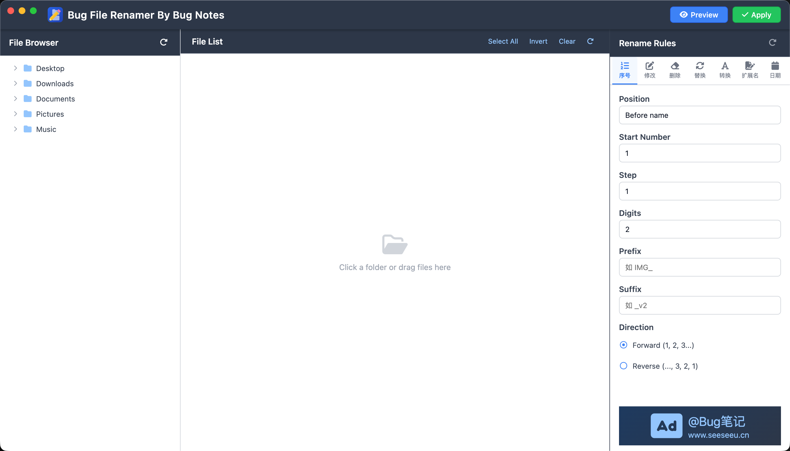

<strong style="font-size:32px;">Bug File Renamer</strong>

<strong>Cross-Platform Batch Renamer · 7 Rules · Live Preview · Conflict Detection · One Click</strong>

<strong>Rename hundreds of files in one second. Choose → Set Rules → Done — batch rename like a formula.</strong>

  
  
  

<a href="./README.md">中文</a> · English

---

---

## 📥 Download

> Some packages exceed 100MB. Please download from [GitHub Releases](https://github.com/bug-notes/Bug-File-Renamer/releases/tag/release).

---

## ⚡ Highlights

- **👁️ Live Preview** — See the final result before applying, zero mistakes
- **🔀 Conflict Detection** — Auto-adds sequential numbers to avoid overwriting
- **📂 Drag & Drop** — Drop files or entire folders, auto-recurses subdirectories
- **✅ Batch Toggle** — Select all / invert / single, process only what you need
- **🖥️ Cross-Platform** — Same UI on macOS, Windows, and Linux
- **⚡ Offline Engine** — 100% local, no internet needed, instant with thousands of files
- **🌐 i18n Ready** — Auto-switches between Chinese and English

---

## 🔧 7 Rename Rules

- **🔢 Numbering** — Custom prefix, suffix, start value, step, and zero-padding
- **✏️ Modify** — Prepend or append text, or insert at a specific position
- **✂️ Delete** — Delete by position, by text match, or N characters from the end
- **🔄 Replace** — Plain text or regex, case-sensitive, global or single match
- **🔤 Convert** — UPPERCASE / lowercase / Title Case / Chinese to Pinyin
- **📎 Extension** — Change, convert case, or remove file extensions entirely
- **📅 Date** — Insert creation or modification date with customizable formats

---

## 🌍 Supported Platforms

- 🍎 **macOS** Intel (x64) / Apple Silicon (ARM) → `.dmg`
- 🪟 **Windows** x64 / x86 (32-bit) → `.exe` installer + portable
- 🐧 **Linux** x64 / ARM → `.AppImage`

---

## 💡 Use Cases

- 📷 **Photo** — Batch rename hundreds of shots with one rule, no more manual work
- 🎬 **Video** — Auto-number drone or camera footage by project + date for clean editing workflow
- 👨‍💻 **Dev** — Rename files in bulk during refactors, add consistent prefixes or suffixes
- 🧪 **QA** — Generate test case files with numbering, archive logs by date
- 📄 **Contract** — Normalize scanned documents by company name + date, find them instantly
- 🎵 **Music** — Strip ads and gibberish from track filenames, build a clean music library
- 📚 **eBook** — Organize your library by author + title, neatly displayed in any reader
- 🏠 **Daily** — Sort WeChat and QQ downloads by date, say goodbye to messy folders
- 🧹 **DevOps** — Archive server logs by date, purge expired files on schedule

---

## 📧 Feedback

Ideas or issues: **foreverox@vip.qq.com**
Website: [www.seeseeu.cn](https://www.seeseeu.cn)

---

© 2026 Bug Notes · Personal Software Workshop

