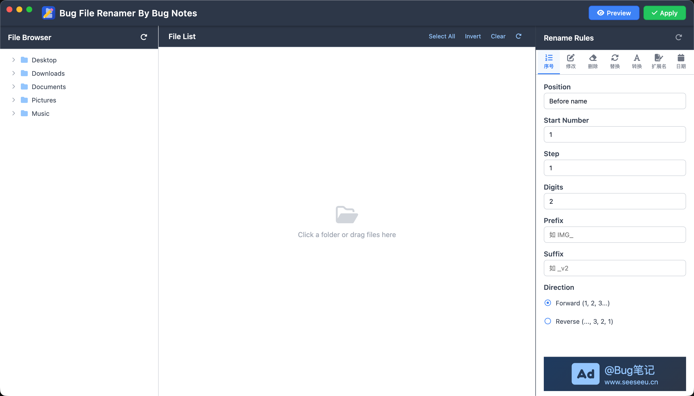

<strong style="font-size:32px;">Bug File Renamer</strong>

<strong>Cross-Platform Batch Renamer · 7 Rules · Live Preview · Conflict Detection · One Click</strong>

<strong>Rename hundreds of files in one second. Choose → Set Rules → Done — batch rename like a formula.</strong>

  
  
  

<a href="./README.md">中文</a> · English

---

---

## 📥 Download

> Some packages exceed 100MB. Please download from [GitHub Releases](https://github.com/bug-notes/Bug-File-Renamer/releases/tag/release).

---

## ⚡ Highlights

- **👁️ Live Preview** — See the final result before applying, zero mistakes
- **🔀 Conflict Detection** — Auto-adds sequential numbers to avoid overwriting
- **📂 Drag & Drop** — Drop files or entire folders, auto-recurses subdirectories
- **✅ Batch Toggle** — Select all / invert / single, process only what you need
- **🖥️ Cross-Platform** — Same UI on macOS, Windows, and Linux
- **⚡ Offline Engine** — 100% local, no internet needed, instant with thousands of files
- **🌐 i18n Ready** — Auto-switches between Chinese and English

---

## 🔧 7 Rename Rules

- **🔢 Numbering** — Custom prefix, suffix, start value, step, and zero-padding
- **✏️ Modify** — Prepend or append text, or insert at a specific position
- **✂️ Delete** — Delete by position, by text match, or N characters from the end
- **🔄 Replace** — Plain text or regex, case-sensitive, global or single match
- **🔤 Convert** — UPPERCASE / lowercase / Title Case / Chinese to Pinyin
- **📎 Extension** — Change, convert case, or remove file extensions entirely
- **📅 Date** — Insert creation or modification date with customizable formats

---

## 🌍 Supported Platforms

- 🍎 **macOS** Intel (x64) / Apple Silicon (ARM) → `.dmg`
- 🪟 **Windows** x64 / x86 (32-bit) → `.exe` installer + portable
- 🐧 **Linux** x64 / ARM → `.AppImage`

---

## 💡 Use Cases

- 📷 **Photo** — Batch rename hundreds of shots with one rule, no more manual work
- 🎬 **Video** — Auto-number drone or camera footage by project + date for clean editing workflow
- 👨‍💻 **Dev** — Rename files in bulk during refactors, add consistent prefixes or suffixes
- 🧪 **QA** — Generate test case files with numbering, archive logs by date
- 📄 **Contract** — Normalize scanned documents by company name + date, find them instantly
- 🎵 **Music** — Strip ads and gibberish from track filenames, build a clean music library
- 📚 **eBook** — Organize your library by author + title, neatly displayed in any reader
- 🏠 **Daily** — Sort WeChat and QQ downloads by date, say goodbye to messy folders
- 🧹 **DevOps** — Archive server logs by date, purge expired files on schedule

---

## 🛠️ Technical Documentation

### Overview

- **Name**: `Bug File Renamer`
- **Purpose**: Cross-platform desktop batch file rename tool
- **Author**: `Bug` Notes
- **Version**: `1.0.0`
- **Website**: `www.seeseeu.cn`
- **Repository**: `github.com/bug-notes/Bug-File-Renamer`
- **Platforms**: `macOS` (`Intel` + `Apple Silicon`), `Windows` (`x64` + `x86`), `Linux` (`x64` + `ARM`)
- **Languages**: Chinese / `English`, auto-switched by system

### Tech Stack

- **Electron `25`** — Desktop framework. Mature and stable, excellent cross-platform compatibility, large community, well-rounded `electron-builder` packaging ecosystem
- **Vue `3.4`** — Front-end `UI` framework. Reactive system naturally suited for live preview, clear `Composition API` logic reuse, small footprint
- **Vite `4.5`** — Build tool. Instant HMR in dev, fast builds, native `Vue SFC` support, simple config
- **electron-builder `24`** — Packaging & release. One-click `dmg`/`nsis`/`AppImage` output, auto-signing, multi-arch support
- **electron-updater `6`** — Auto update. Seamless integration with `electron-builder`, `generic` static server support, forced-update mechanism
- **@vitejs/plugin-vue `4.6`** — `Vue SFC` compilation. Official `Vite` plugin, compiles `.vue` single-file components
- **Node.js test (built-in)** — Unit testing. Zero dependencies, native support, consistent with the project toolchain

### Architecture

#### Overall Architecture

- **Main Process** (`Electron Main Process`) — window management, system menu, auto update, custom protocol, `IPC` handling
- **Security Bridge** (`Preload Script`) — exposes a safe `API` via `contextBridge`, isolates the `Node.js` environment
- **Renderer Process** (`Vue 3 SPA`) — `UI` interaction, rule engine computation, state management, i18n

#### Data Flow

- **File Import** (main → `IPC` → renderer) — obtain file paths via system dialog or drag-and-drop, `readDir` reads directory contents
- **Rule Config** (renderer component → `store`) — user configures parameters in the rule panel, written to the global reactive `store.tabParams`
- **Preview** (`store` → `renamer.js` → component) — rule engine processes filenames in a fixed chain order, result written to `file.newName`
- **Apply Rename** (renderer → `IPC` → main) — `renameBatch` passes the operation list, main calls `fs.renameSync`
- **Result Return** (main → `IPC` → renderer) — returns success/failure status per operation, updates `file.status`

#### Security Design

- **Context Isolation** (`contextIsolation: true`) — renderer cannot directly access `Node.js`/`Electron` internals
- **Node Integration Off** (`nodeIntegration: false`) — prevents renderer from executing system-level code
- **Protocol Whitelist** (only `app://` allowed) — blocks navigation to external `URL`s, anti-phishing
- **No Popups** (`setWindowOpenHandler` returns `deny`) — prevents malicious sites from opening new windows
- **DevTools Off in Prod** (blocks `F12` and `Cmd+Shift+I`) — prevents accidental/malicious debugging
- **External Link Isolation** (`shell.openExternal` only allows `https`) — opens in the default browser without polluting the app window

#### Component Design

##### Layout

- **`App.vue`** — root component, three-panel layout container, menu event listener
- **`TopBar.vue`** (parent: `App`) — top toolbar (app icon, title, preview/apply buttons)
- **`FileTree.vue`** (parent: `App`) — left file tree (system directories, expand/collapse, permission detection)
- **`FileTable.vue`** (parent: `App`) — middle file list (table, selection, drag-and-drop)
- **`RulePanel.vue`** (parent: `App`) — right rule panel (`Tab` switching, reset, ad slot)
- **`TreeNode.vue`** (parent: `FileTree`) — recursive tree node (expand/collapse/lock icon)

##### Rule Tab Components

- **`TabNumbering.vue`** (parent: `RulePanel`) — numbering rule parameter form
- **`TabModify.vue`** (parent: `RulePanel`) — modify rule parameter form
- **`TabDelete.vue`** (parent: `RulePanel`) — delete rule parameter form
- **`TabReplace.vue`** (parent: `RulePanel`) — replace rule parameter form
- **`TabConvert.vue`** (parent: `RulePanel`) — convert rule parameter form
- **`TabExtension.vue`** (parent: `RulePanel`) — extension rule parameter form
- **`TabDate.vue`** (parent: `RulePanel`) — date rule parameter form

##### Ad Component

- **`AdBanner.vue`** (parent: `RulePanel`) — bottom ad slot (`webview`)

### Directory Layout

#### Root

- **`main.js`** (entry) — `Electron` main process, window creation, menu, update, protocol registration
- **`preload.js`** (entry) — security bridge, exposes `window.electronAPI` via `contextBridge`
- **`vite.config.js`** (config) — `Vite` build config, entry, output, minification, dev server
- **`package.json`** (config) — dependency management, `npm scripts`, `electron-builder` packaging config
- **`appInfo.json`** (config) — app metadata (CN/EN name, description, version, update URL)

#### Entry & State

- **`src/index.html`** (entry) — `HTML` entry, mounts `#app`
- **`src/main.js`** (entry) — `Vue` app creation, `store` injection, global styles import
- **`src/App.vue`** (root component) — three-panel layout + menu event listener
- **`src/store/index.js`** (state) — global reactive `store` (file list, current folder, active `Tab`, rule params)

#### Internationalization

- **`src/i18n/index.js`** (engine) — translation engine, nested `key` lookup + placeholder substitution
- **`src/i18n/zh.js`** (strings) — Chinese translations
- **`src/i18n/en.js`** (strings) — English translations

#### Layout Components

- **`src/layout/TopBar.vue`** (layout) — top toolbar
- **`src/layout/FileTree.vue`** (layout) — left file tree
- **`src/layout/TreeNode.vue`** (layout) — recursive tree node
- **`src/layout/FileTable.vue`** (layout) — middle file list
- **`src/layout/RulePanel.vue`** (layout) — right rule panel

#### Tab Components

- **`src/components/tabs/TabNumbering.vue`** (business) — numbering rule parameter form
- **`src/components/tabs/TabModify.vue`** (business) — modify rule parameter form
- **`src/components/tabs/TabDelete.vue`** (business) — delete rule parameter form
- **`src/components/tabs/TabReplace.vue`** (business) — replace rule parameter form
- **`src/components/tabs/TabConvert.vue`** (business) — convert rule parameter form
- **`src/components/tabs/TabExtension.vue`** (business) — extension rule parameter form
- **`src/components/tabs/TabDate.vue`** (business) — date rule parameter form

#### Ad Component

- **`src/components/ad/AdBanner.vue`** (business) — bottom ad slot

#### Utils & Engines

- **`src/utils/renamer.js`** (engine) — rename engine (preview, conflict detection, conflict resolution, execution)
- **`src/utils/rules.mjs`** (engine) — `7` rule function implementations
- **`src/utils/filename.mjs`** (engine) — filename parsing (`parseFilename`) and merging (`joinFilename`)
- **`src/utils/menu.js`** (util) — menu building, language switching, translated text
- **`src/utils/ipc.js`** (util) — `IPC` channel registration (dialog, filesystem, `Shell`, network check)
- **`src/utils/about.js`** (util) — about window creation and template rendering

#### Styles

- **`src/styles/main.css`** (style) — global styles (buttons, inputs, tooltips, layout, status labels, dark background)

#### Static Assets

- **`assets/icon.png`** (asset) — app icon
- **`assets/icon.svg`** (asset) — top toolbar `SVG` icon
- **`assets/about.html`** (asset) — about window `HTML` template

#### Tests

- **`tests/filename.test.mjs`** (test) — filename parse/merge
- **`tests/numbering.test.mjs`** (test) — numbering rule
- **`tests/modify.test.mjs`** (test) — modify rule
- **`tests/delete.test.mjs`** (test) — delete rule
- **`tests/replace.test.mjs`** (test) — replace rule
- **`tests/convert.test.mjs`** (test) — convert rule
- **`tests/extension.test.mjs`** (test) — extension rule
- **`tests/date.test.mjs`** (test) — date rule
- **`tests/rename-exec.test.mjs`** (test) — rename execution flow

#### Build Output

- **`dist/`** (output) — `Vite` build output
- **`release/`** (output) — `electron-builder` package output (`dmg`/`exe`/`AppImage`)

### Feature Design

#### Three-Panel Layout

- **Left File Tree** (`320px`) — quick access to system directories, folder expand/collapse, permission detection, auto-expand target path after drop
- **Middle File List** (flexible) — file table (original/new name/extension/status), select all/invert/clear, drag-and-drop
- **Right Rule Panel** (`320px`) — `7` rule `Tab` switching, parameter config, reset button, bottom ad slot
- **Top Toolbar** (full width) — app icon + title + preview/apply buttons, `macOS` traffic-light offset, window drag region

#### File Tree

- **Default Directories** — one-click access to `Desktop`/`Downloads`/`Documents`/`Pictures`/`Music` system paths
- **Lazy Loading** — child directories load on expand, only root nodes initially
- **Permission Aware** — locked icon on no-permission directories, click prompts user to grant access in System Settings
- **State Persistence** — restores previous expand state after refresh, no lost navigation
- **Drag Linkage** — auto-expands to the target directory after dropping files/folders

#### File List

- **Table Display** — original name, new name (after preview), extension, status (original/modified/renamed/error)
- **File Icons** — auto-matches `Font Awesome` icons by extension + color coding (images orange, audio purple, video red, `PDF` red, code green)
- **Batch Selection** — select all/invert/clear/single, shows selected count `N/M`
- **Drag & Drop** — drop files or folders, folders auto-recurse subdirectories
- **System Files** — hidden files (`.` prefix) and system files (`Thumbs.db`/`Desktop.ini`) shown dimmed
- **Bottom Path Bar** — shows the full path of the current folder

#### 7 Rename Rules

- **Numbering** — rename files by sequence number. Params: prefix/suffix, start value, step, zero-padding, ascending/descending, number position (before/after name)
- **Modify** — add/insert text into filename. Params: prepend, append, insert at position
- **Delete** — remove characters from filename. Params: delete specified text (global match), delete `N` chars by position, delete `N` chars from end
- **Replace** — find and replace filename text. Params: find text, replace text, regex mode, case-sensitive, global replace
- **Convert** — change filename case. Params: UPPERCASE/lowercase/Title Case/Chinese to Pinyin
- **Extension** — change file extension. Params: set to specified extension, uppercase/lowercase extension, remove extension
- **Date** — rename by file date. Params: date source (creation/modification time), custom format (e.g. `yyyy-MM-dd_HHmm`), naming mode (replace/prefix/suffix)

#### Rule Chain Engine

- **Execution Order** — `delete` → `replace` → `convert` → `modify` → `numbering` → `date` → `extension`
- **Chained Processing** — each rule's output becomes the next rule's input, name transforms step by step
- **Skip Unconfigured** — rules with empty params auto-skip, no effect on filename
- **Numbering Special Case** — only default values (`start=1`/`step=1`/`padding=2`) count as unconfigured
- **Date Preprocessing** — file timestamps fetched via `IPC` and cached before preview, avoiding repeated requests

#### Conflict Detection & Resolution

- **Detection** — iterate all modified files, group by new full path, `2`+ occurrences of the same target counts as conflict
- **Resolution** — keep the first file's original name, subsequent duplicates get `(1)`/`(2)` suffixes before the extension
- **Timing** — auto-runs after preview, before the actual rename

#### Internationalization

- **Language Detection** — reads `app.getLocale()` at startup, `zh` prefix → Chinese, otherwise English
- **Translation Engine** — nested `key` support (e.g. `fileTable.title`), `{0}`/`{1}` placeholder substitution
- **Coverage** — menus, window titles, component text, status labels, error messages, about window
- **Live Switch** — menu language switch notifies renderer via `IPC` `setLang`, all components update reactively
- **App Title** — read live from `appInfo.json`, main and renderer stay in sync

#### Auto Update

- **Detection** — silent check at startup (no dialog if up-to-date), manual trigger from menu (feedback if up-to-date)
- **Forced Update** — new version must be updated, only "Update Now" and "Quit" options
- **Download Feedback** — "Downloading" prompt, then "Restart to Install" prompt on completion
- **Anti Duplicate Dialogs** — `updateDialogOpen` flag prevents multiple update dialogs
- **Update Source** — `updateUrl` field in `appInfo.json`, using `generic` static server

#### About Window

- **Window Type** — modal window (blocks parent), fixed `420x360`, non-resizable
- **Content Rendering** — reads `assets/about.html` template, replaces placeholders (icon `base64`, name, version, author, description, website)
- **External Links** — intercepts navigation and `window.open`, opens with the default browser
- **Lifecycle** — auto-closes on language switch, clears reference after close, single instance at a time

#### Development & Build

- **`npm run dev`** — starts `Vite` dev server (`localhost:5173`), HMR
- **`npm run build`** — `Vite` builds frontend to `dist/`
- **`npm run start`** — build + launch `Electron` app
- **`npm test`** — run `Node.js` native tests (`tests/` directory)
- **`npm run build:mac`** — build + package as `macOS dmg` (`x64` + `arm64`)
- **`npm run build:win`** — build + package as `Windows nsis` installer + portable (`x64` + `ia32`)
- **`npm run build:linux`** — build + package as `Linux AppImage` (`x64` + `arm64`)
- **`npm run build:all`** — build + package all platforms

#### Packaging Output

- **`macOS`** — `.dmg`, `x64` + `arm64` (universal)
- **`Windows`** — `.exe` installer (`NSIS`) + portable, `x64` + `ia32`
- **`Linux`** — `.AppImage`, `x64` + `arm64`

---

## 📧 Feedback

Ideas or issues: **foreverox@vip.qq.com**
Website: [www.seeseeu.cn](https://www.seeseeu.cn)

---

© 2026 Bug Notes · Personal Software Workshop

